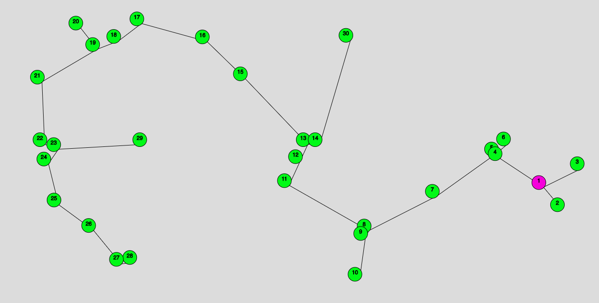

Temas:

- Grafos 2

# NomedoProjeto

**Número da Lista**: 1 
**Conteúdo da Disciplina**: Grafos2 

## Alunos

| Matrícula  | Aluno                           |
| ---------- | ------------------------------- |
| 15/0120630 | Caio Oliveira de Moraes         |
| 16/0015294 | Matheus Rodrigues do Nascimento |

## Sobre

O projeto consiste em apresentar visualmente o comportamento do algoritmo de Prim sobre um grafo. Usamos a biblioteca P5js, pra criar desenhos e animações no browser.

## Screenshots

 

 

## Instalação

**Linguagem**: javascript 
O Projeto possui dois arquivos HTML, cada arquivo é responsável por um tipo de visualização diferente, para executa-los é necessário apenas um click duplo sobre o arquivo, e o mesmo será executado no browser.

## Uso

O projeto possui dois tipos de visualização do algoritmo de Prim, o arquivo html da pasta **PrimVisualizer** consiste na geração randomica dos nós, onde é possível visualizar o menor caminho traçado sobre todos os nós, o segundo arquivo html na pasta **CreateYourPrim** consiste na inserção de cada nó definido pelo usuário, e logo em seguida, o mesmo poderá iniciar a execução do algoritmo.
